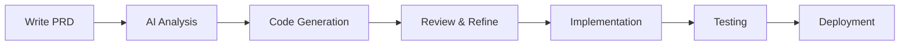
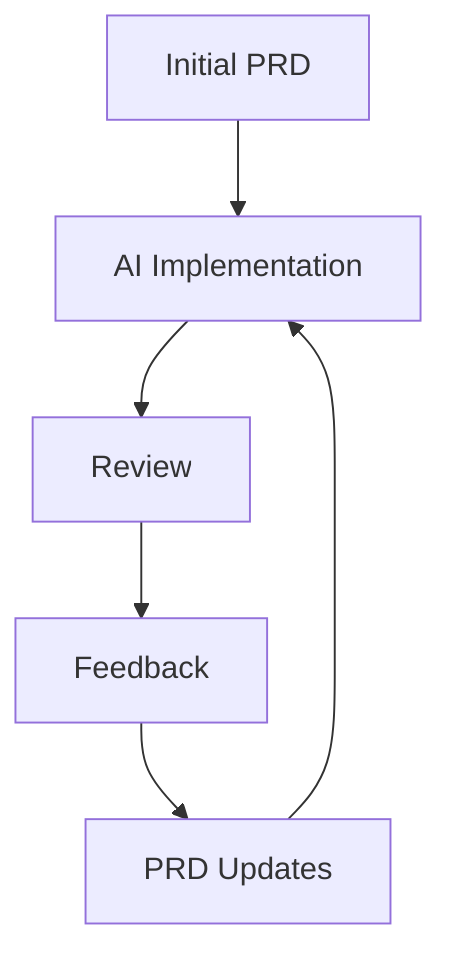

# AI Collaboration

Learn how to effectively collaborate with AI in your development process. This guide covers best practices, patterns, and tips for maximizing AI assistance.

## Understanding AI Capabilities

### 1. Code Generation
- Complete implementation from PRD
- Refactoring suggestions
- Test case generation
- Documentation writing

### 2. Code Review
- Security analysis
- Performance optimization
- Style consistency
- Best practices enforcement

### 3. Problem Solving
- Debug assistance
- Error analysis
- Solution suggestions
- Pattern recognition

## Collaboration Patterns

### 1. PRD-First Development



### 2. Iterative Refinement



## Best Practices

### 1. Writing Clear Requirements
- Be specific and detailed
- Use consistent terminology
- Provide examples when possible
- Define acceptance criteria

### 2. Effective Communication
- Use structured commands
- Break down complex tasks
- Provide necessary context
- Ask for clarification

### 3. Review and Iteration
- Review AI-generated code
- Provide feedback
- Iterate on solutions
- Document decisions

## Common Interaction Patterns

### 1. Code Generation

```yaml
request:
  type: "generate"
  component: "user-authentication"
  requirements:
    - "Email/password login"
    - "OAuth support"
    - "Password recovery"
```

### 2. Code Review

```yaml
request:
  type: "review"
  focus:
    - "Security"
    - "Performance"
    - "Best practices"
  files:
    - "src/auth/*"
```

### 3. Problem Solving

```yaml
request:
  type: "debug"
  issue: "Authentication failure"
  context:
    - "Error logs"
    - "Current implementation"
    - "Expected behavior"
```

## AI Memory System

### 1. Context Retention
- Project structure
- Previous decisions
- Code patterns
- User preferences

### 2. Knowledge Base
- Technical documentation
- Best practices
- Common patterns
- Error solutions

## Tips for Success

1. **Be Explicit**
   - Clear requirements
   - Specific constraints
   - Detailed context

2. **Iterative Approach**
   - Start small
   - Build incrementally
   - Regular feedback

3. **Documentation**
   - Record decisions
   - Document patterns
   - Share learnings

## Common Challenges

### 1. Ambiguous Requirements
- Solution: Use structured PRD format
- Provide clear examples
- Define success criteria

### 2. Complex Logic
- Break down into smaller tasks
- Use diagrams and flowcharts
- Provide business context

### 3. Integration Issues
- Define clear interfaces
- Document dependencies
- Test incrementally

## Related Resources

- [PRD Structure](./prd-structure.md)
- [Windsurfrules Configuration](./windsurfrules.md)
- [Custom Templates](../how-to/custom-templates.md)
