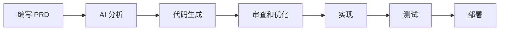
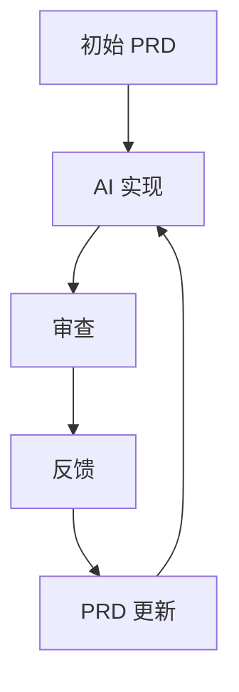

# AI 协作指南

学习如何在开发过程中与 AI 进行有效协作。本指南涵盖了最佳实践、模式和技巧，以最大化 AI 辅助效果。

## 了解 AI 能力

### 1. 代码生成
- 从 PRD 完成实现
- 重构建议
- 测试用例生成
- 文档编写

### 2. 代码审查
- 安全性分析
- 性能优化
- 风格一致性
- 最佳实践执行

### 3. 问题解决
- 调试协助
- 错误分析
- 解决方案建议
- 模式识别

## 协作模式

### 1. PRD 优先开发



### 2. 迭代优化



## 最佳实践

### 1. 编写清晰的需求
- 具体且详细
- 使用一致的术语
- 提供示例
- 定义验收标准

### 2. 有效沟通
- 使用结构化命令
- 拆分复杂任务
- 提供必要上下文
- 及时澄清疑问

### 3. 审查和迭代
- 审查 AI 生成的代码
- 提供反馈
- 迭代解决方案
- 记录决策

## 常见交互模式

### 1. 代码生成

```yaml
request:
  type: "generate"
  component: "用户认证"
  requirements:
    - "邮箱/密码登录"
    - "OAuth 支持"
    - "密码找回"
```

### 2. 代码审查

```yaml
request:
  type: "review"
  focus:
    - "安全性"
    - "性能"
    - "最佳实践"
  files:
    - "src/auth/*"
```

### 3. 问题解决

```yaml
request:
  type: "debug"
  issue: "认证失败"
  context:
    - "错误日志"
    - "当前实现"
    - "预期行为"
```

## AI 记忆系统

### 1. 上下文保持
- 项目结构
- 历史决策
- 代码模式
- 用户偏好

### 2. 知识库
- 技术文档
- 最佳实践
- 常见模式
- 错误解决方案

## 成功技巧

1. **明确表达**
   - 清晰的需求
   - 具体的约束
   - 详细的上下文

2. **迭代方法**
   - 从小处着手
   - 逐步构建
   - 定期反馈

3. **文档记录**
   - 记录决策
   - 记录模式
   - 分享经验

## 常见挑战

### 1. 需求模糊
- 解决方案：使用结构化 PRD 格式
- 提供清晰示例
- 定义成功标准

### 2. 复杂逻辑
- 拆分为小任务
- 使用图表和流程图
- 提供业务上下文

### 3. 集成问题
- 定义清晰接口
- 记录依赖关系
- 增量测试

## 相关资源

- [PRD 结构](./prd-structure.md)
- [Windsurfrules 配置](./windsurfrules.md)
- [自定义模板](../how-to/custom-templates.md)
